#  🎭 Facial Emotion Recognition  

<p align="left">
  
  
  
  
    
  
  
  
  
  
  
  
    
  
  
  
  
</p> 

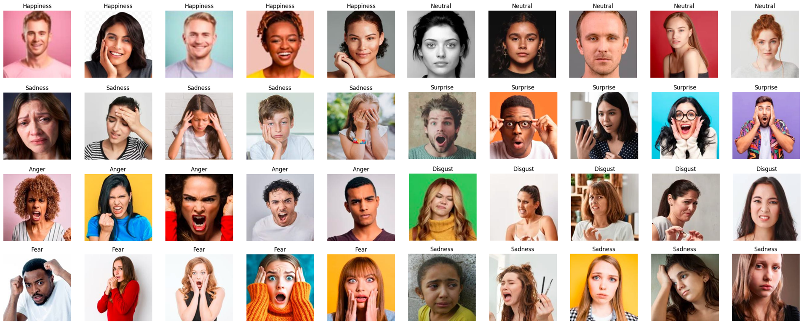 

## 🧾 Overview  

This project focuses on classifying human emotions from facial expressions using deep learning and transfer learning techniques. Multiple convolutional neural network (CNN) architectures (including ConvNeXt, EfficientNet, ResNet, and VGG) are systematically evaluated and compared to identify the most effective model for this task. The models are trained and tested on a custom-built RGB image dataset comprising seven emotion classes: `Anger`, `Disgust`, `Fear`, `Happiness`, `Neutral`, `Sadness`, and `Surprise`. Performance is assessed using key metrics such as accuracy, F1-score, and confusion matrices, while Grad-CAM visualizations are utilized to enhance interpretability by highlighting the regions influencing model predictions. The project aims to address the challenges of recognizing subtle and complex emotional expressions while identifying robust and efficient architectures. Additionally, a Gradio-based [web app](https://huggingface.co/spaces/ShaikhBorhanUddin/Facial_Emotion_Recognition) has been developed and deployed, enabling users to interact with the model and obtain real-time emotion predictions. 

## 🗂️ Project Structure  

The following structure is maintained in this repository. Dataset is not included due to large number of images; however, it can be accessed or downloaded from [Kaggle](https://www.kaggle.com/datasets/shaikhborhanuddin/fer-25). Saved deep learning models are also not included in the repository, but can be accessed or downloaded from the following [google drive](https://drive.google.com/drive/folders/1fawjtIIxCBRv8H-JiBYYg88DraSdq3Sb?usp=sharing).

```bash
Facial-Emotion-Recognition/
│
├── Image/                        # 📊 Project visuals (Images for readme file documentation)
│
├── Dataset/                      # 📃 Not included in the repository duue to exceeding maximum size
│
├── models/                       # 🤖 Not included in the repository duue to large size 
│                          
├── src/                          # 🧠 Core source code (preprocessing, training, testing & visualization)
│     │
│     ├── FER_25_ConvNeXtBase.ipynb
│     ├── FER_25_EfficientNetB2.ipynb
│     ├── FER_25_EfficientNetB2_Modified.ipynb
│     ├── FER_25_EfficientNetB3.ipynb
│     ├── FER_25_EfficientNetB3_Modified.ipynb
│     ├── FER_25_EfficientNetB4.ipynb
│     ├── FER_25_ResNet101V2.ipynb
│     ├── FER_25_ResNet152V2.ipynb
│     ├── FER_25_ResNet50V2.ipynb
│     ├── FER_25_VGG19_Final.ipynb
│     └── VGG_16_Final.ipynb
│
├── app.py                         # 🌐 Web app (Gradio deployment files)
│
├── requirements.txt               # 📃 Python dependencies
│
├── runtime.txt                    # 📃 Python deployment dependencies
│
├── Licence.MD                     # 📜 License information
│
└── README.md                      # 📘 Project documentation
```

## 🗃️ Dataset  

The dataset used in this project is the [FER_25 dataset](https://www.kaggle.com/datasets/shaikhborhanuddin/fer-25), which consists of **7,200 high-resolution (224×224) RGB images** distributed evenly across seven emotion categories: Anger, Disgust, Fear, Happiness, Neutral, Sadness, and Surprise. As illustrated in the image distribution chart, each category contains approximately 925–945 training images and 96–125 test images, maintaining a balanced class representation.  

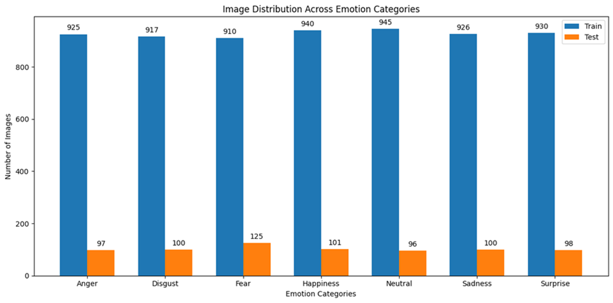  

Unlike widely used datasets such as [CK+](https://www.kaggle.com/datasets/shuvoalok/ck-dataset) or [FER-2013](https://www.kaggle.com/datasets/msambare/fer2013), which include only 38×38 grayscale images, the FER_25 dataset is far more suitable for training deep transfer learning models, especially pretrained architectures like EfficientNet, VGG and ConvNeXt. The higher resolution and color information enhance the ability of models to capture subtle facial features associated with complex emotional expressions.  

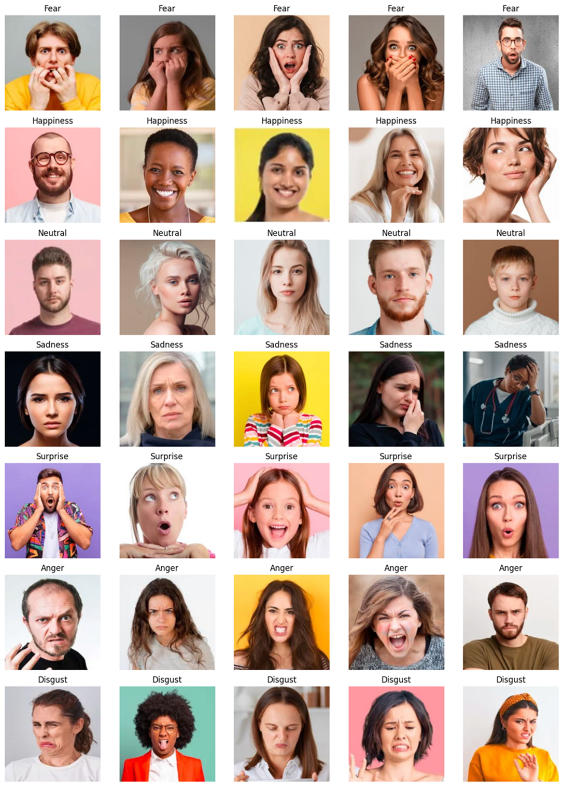  

The dataset was manually assembled by **web scraping from multiple stock image platforms including Adobe Stock, Getty Images, Shutterstock, iStock, and Freepik**. Each image was carefully selected to reflect diverse and realistic emotional expressions in various lighting, backgrounds, and ethnicities, making FER_25 a more robust and scalable choice for real-world emotion recognition tasks.  

## 🔬 Model Architecture

All models followed a structured and consistent architecture pipeline involving a pretrained CNN backbone, global average pooling, dense layers with ReLU activation, and a softmax output for multi-class emotion classification. A `Dropout(0.5)` layer was uniformly applied before the classification head to mitigate overfitting.

- **EfficientNetB2 to B5**: These models varied in depth and parameter size (B2: 8.4M to B5: 29.5M) and mostly used a single dense layer of 512 units.

- **Modified EfficientNetB2** included **two dense layers (1024 → 512)**, increasing capacity with 10.7M parameters.

- **Modified EfficientNetB3** further extended this to **three dense layers (1024 → 512 → 256)**, totaling 13M parameters.

- **VGG16** and **VGG19** used their classic convolutional stacks followed by a dense layer of 512 units, with respective parameters of 14.9M and 20.2M.

- **ResNet50V2**, **101V2**, and **152V2** increased in complexity and depth, topping out at **59.3M parameters** for ResNet152V2.

- **ConvNeXtBase**, the most computationally intensive model with **88M parameters**, leveraged modern attention-inspired architecture, ending in a dense layer of 512 units.

Despite architectural differences, the consistent training logic and layered designs allowed fair comparison across models. The Modified EfficientNet and ConvNeXtBase models benefitted from deeper, flexible classification heads and TPU acceleration, leading to superior generalization.  

## 🧪 Experiments  

A series of deep learning models were trained and evaluated to recognize facial emotions across seven categories. All models shared a unified training protocol with 30 epochs, a dropout rate of 0.5, ReLU activation in dense layers, softmax output activation, Adam optimizer, and categorical crossentropy loss. The base learning rate was set to 0.001, with a fine-tuning learning rate of 1e-4 (except VGG16 and VGG19, which used 1e-5). Training was conducted on an **NVIDIA A100 GPU**, except for the **Modified EfficientNetB2** and **Modified EfficientNetB3**, which were trained using **v5e Trillium TPUs** for enhanced scalability.

Batch sizes were tailored to each model's capacity. For example, EfficientNetB5 and VGG19 used a smaller batch size of 128 due to their larger parameter count (29.5M and 20.2M, respectively), while ResNet50V2 and ResNet101V2 utilized batch sizes of 512. These batch size variations were chosen to balance memory usage and convergence efficiency.

All models were evaluated on accuracy, F1 score, precision, recall, and categorical loss. Results clearly favored **ConvNeXtBase** and **Modified EfficientNetB3**, which achieved top-tier performance, while models such as **ResNet152V2 showed signs of overfitting despite their complexity**. This consistent and controlled experimental setup enables reliable performance comparison across architectures and training environments.

## 📊 Results  

Performance matrix summary for all models are included in this section. For more details of model architecture, performance matrix and output visualization please browse `Src` folder of this repository or click specific models from Model column below.  

| Model                   | Accuracy | F1 Score | Loss   | Precision | Recall  | Training       |
|-------------------------|----------|----------|--------|-----------|---------|----------------|
| [EfficientNetB5](https://colab.research.google.com/drive/1dLI85NvCjIk47vGyA0MGb4E0iR4n_FsF?usp=sharing)          | 0.8386   | 0.7556   | 0.6814 | 0.8473    | 0.8360  | Successful     |
| [EfficientNetB4](https://colab.research.google.com/drive/1y9-VMEBLe1RTq5fm76BYgxVDLtGewRcV?usp=sharing)          | 0.8185   | 0.7384   | 0.6205 | 0.8246    | 0.8097  | Successful     |
| [EfficientNetB3](https://colab.research.google.com/drive/1C-gl6DQVe1x7VawELB-L7zkEF6XmIv9k?usp=sharing)          | 0.7913   | 0.7209   | 0.6796 | 0.8034    | 0.7900  | Successful     |
| [EfficientNetB2](https://colab.research.google.com/drive/1xLMx-wkydidC_Ko9VBZ4PH3vzho29-SN?usp=sharing)          | 0.8324   | 0.7100   | 0.6005 | 0.8434    | 0.8256  | Successful     |
| [EfficientNetB3 Modified](https://colab.research.google.com/drive/1u9en52gj2jQLFx7X-Qkw_qFpk5GZDZUn?usp=sharing) | 0.8342   | 0.8535   | 0.7443 | 0.8387    | 0.8284  | Successful     |
| [EfficientNetB2 Modified](https://colab.research.google.com/drive/1ys4Nl97FWRUAN4Q8JYF4wYzBaNQS_ImT?usp=sharing) | 0.8083   | 0.6756   | 0.6470 | 0.8129    | 0.7978  | Successful     |
| [ConvNeXtBase](https://colab.research.google.com/drive/1lBYY36mVE5F2jIo4RSMj9kQ1JRHzDr2a?usp=sharing)           | 0.8342   | 0.8535   | 0.7443 | 0.8387    | 0.8284  | Successful     |
| [VGG16](https://colab.research.google.com/drive/1s78M-6gHwXe3O2jsNCtjmG5hsJ78KjGr?usp=sharing)                   | 0.7444   | 0.3558   | 0.6762 | 0.8164    | 0.6580  | Successful     |
| [VGG19](https://colab.research.google.com/drive/1AHIS-zlg0FIy0BzYpDv0GUWqkNqdwdii?usp=sharing)                   | 0.8112   | 0.6560   | 0.5309 | 0.8558    | 0.7876  | Successful     |
| [ResNet152V2](https://colab.research.google.com/drive/1a-M7Q0gTKA1-vi-bfSkDeph5xBiH7WqS?usp=sharing)             | 0.6464   | 0.4481   | 1.7839 | 0.6563    | 0.6456  | Overfitted     |
| [ResNet101V2](https://colab.research.google.com/drive/12EVYmC6w6fD50sBfiMwnUncZF0XDj0_2?usp=sharing)             | 0.7362   | 0.4074   | 1.2637 | 0.7373    | 0.7301  | Successful     |
| [ResNet50V2](https://colab.research.google.com/drive/1nUVm3asXfm1pYWG8NVcoeIvBad9bDLCT?usp=sharing)              | 0.6985   | 0.3915   | 1.5528 | 0.7040    | 0.6969  | Successful     |

The ConvNeXtBase and EfficientNetB3 Modified models emerged as top performers, both achieving the highest F1 score (0.8535) and excellent accuracy (~83.4%), indicating strong consistency in classification. EfficientNetB5 also performed well with an accuracy of 83.86%, though its F1 score (0.7556) was noticeably lower, suggesting it may not generalize as effectively across all emotion classes. Among traditional architectures, VGG16 performed the worst in F1 score (0.3558), pointing to major misclassifications despite decent precision. VGG19 improved significantly over VGG16 after correction but still lagged behind the top models. Notably, ResNet152V2 was the only model flagged as overfitted, with both accuracy and F1 score dropping below acceptable levels. The results suggest that modern architectures like ConvNeXt and modified EfficientNets handle complex, multi-class emotional data more robustly than deeper or older CNN backbones.  

## 📈 ROC Curves  

ROC curve analysis of all tested models are included in this section. ResNet152V2 was excluded due to overfitting in training phase. Also, customized version of EfficientNetB2 and B3 are not included in the analysis.

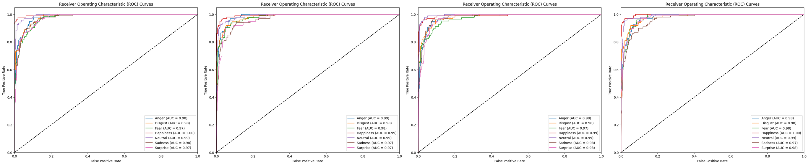  

In the four image above, the ROC curves for the EfficientNet models B2, B3, B4, and B5 are shown. All four models demonstrate excellent class discrimination, with AUC scores mostly ranging from 0.97 to 1.00 across all seven emotion classes (Anger, Disgust, Fear, Happiness, Neutral, Sadness, and Surprise). Notably, EfficientNetB5 and B4 show near-perfect AUCs of 1.00 for "Happiness" and "Neutral," indicating extremely strong classification performance for those classes. There is minimal deviation among classes, and all models exhibit steep rises near the Y-axis, reflecting high true positive rates and low false positives—hallmarks of effective multi-class classification models.  

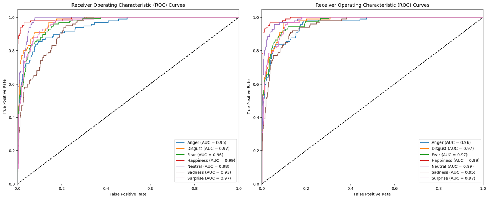  

For VGG class, the ROC curves for the VGG16 (left image above) and VGG19 (right image) models are displayed. Both models still achieve reasonably high AUCs (mostly in the 0.93–0.99 range), though slightly lower compared to EfficientNet models. A noticeable decline in performance is seen for "Anger" (VGG19: 0.95) and "Sadness" (VGG19: 0.93), suggesting these emotions were harder to classify accurately. Additionally, the ROC curves exhibit more fluctuation, and the curves are less smooth, which aligns with the models' noted overfitting during training. This performance inconsistency suggests that while VGG models can still capture emotional distinctions, their generalization ability is weaker.

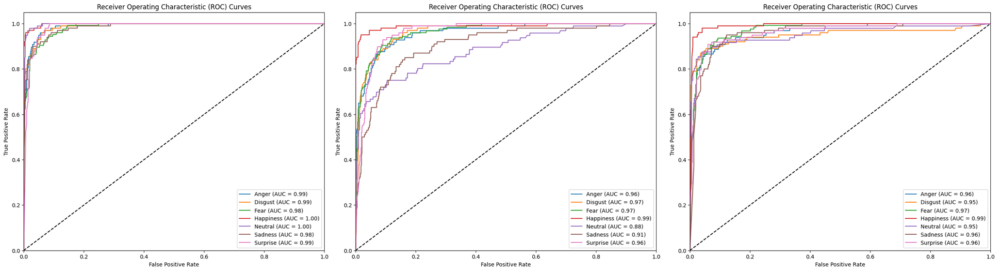  

In the last three image, ConvNeXtBase, ResNet50V2, and ResNet101V2 are analyzed. These models deliver robust classification results, comparable to EfficientNetB2–B5, with AUCs consistently between 0.95 and 1.00. ConvNeXtBase (left image) stands out with a perfect AUC of 1.00 for both "Happiness" and "Neutral," while maintaining strong performance across the other classes. The ROC curves of ResNet101V2 (right image) and ResNet50V2 (middle image) are closely packed with high slopes, indicating minimal class confusion and strong predictive power. Unlike VGG models, these architectures exhibit better generalization, as supported by both their AUC scores and the smoothness and steepness of the ROC curves.

## 📉 Confusion Matrix  

Confusion Matrix of all models discussed in ROC tab are discussed in this section.  

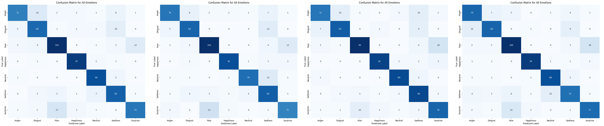  

The images displayed above show confusion matrices for EfficientNet B2, B3, B4, and B5 models (left to right). Across all models, Fear, Happiness, and Neutral consistently show strong classification performance, with high true positive counts—Fear especially stands out with values ranging from 99 to 104. However, Surprise and Sadness frequently get misclassified, particularly into Fear and Neutral, which suggests that the visual features of these emotions may overlap and pose challenges even for deeper networks. A trend of performance improvement is visible as we move from B2 to B5: the number of true positives increases slightly (e.g., Anger improves from 71 to 79, Disgust from 75 to 80), and off-diagonal confusion for classes like Sadness and Surprise becomes more controlled. This indicates that deeper EfficientNet variants (B4 and B5) are better at capturing fine-grained emotional differences.  

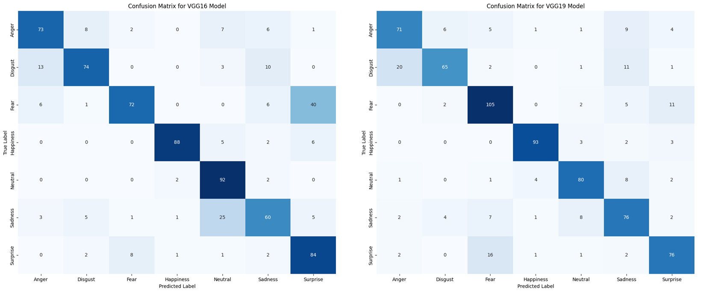  

The second images contain confusion matrices for VGG16 (left) and VGG19 (right). The differences in performance are stark—VGG19 outperforms VGG16, particularly in classifying Fear, where true positives jump from 72 to 105. VGG16 struggles notably with Sadness and Surprise, misclassifying Sadness as Neutral (25 times) and Surprise as Fear (8 times). These high misclassification rates point to its limited depth compared to VGG19. VGG19 demonstrates improved balance, especially for difficult classes like Sadness and Disgust, though confusion with overlapping expressions such as Fear–Surprise and Neutral–Sadness still exists. Overall, while both VGG models lag behind EfficientNet B4/B5 in overall robustness, VGG19 shows significant gains over VGG16, benefiting from its deeper convolutional layers and enhanced feature extraction.  

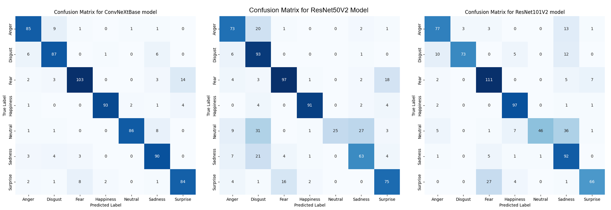  

The confusion matrices show that the ConvNeXtBase model (left) achieves the highest accuracy, with strong predictions across most classes—e.g., 103 correct for Fear, 93 for Happiness, and 86 for Neutral, with minimal confusion (only 8 Neutral misclassified as Sadness). In contrast, the ResNet50V2 model (middle) struggles with overlapping emotions: only 25 Neutral samples are correctly predicted, while 31 and 27 are wrongly classified as Disgust and Sadness, respectively; Surprise also suffers, with only 75 correct and 16 misclassified as Fear. The ResNet101V2 model (right) improves on this with 46 correct Neutral predictions and stronger results for Fear (111 correct), but still misclassifies 36 Neutral as Sadness and 27 Surprise as Fear. Overall, ConvNeXtBase clearly outperforms both ResNet models in both precision and consistency across emotion categories.

## 🖼️ Visualizations  

This project incorporates extensive visual analysis to interpret and validate model performance beyond traditional metrics. **Grad-CAM** and **Grad-CAM++** visualizations were employed to highlight the facial regions influencing the model's predictions, aiding in model explainability and transparency. Confusion matrices provide detailed insight into misclassifications across all emotion classes. ROC curves compare the true positive rates against false positives across different thresholds for each model, helping evaluate class-wise performance. These visual tools complement the evaluation metrics and offer deeper understanding into experimented model’s behavior.  

Example of some **interpretable correct classification** is shown in next 6 images.  

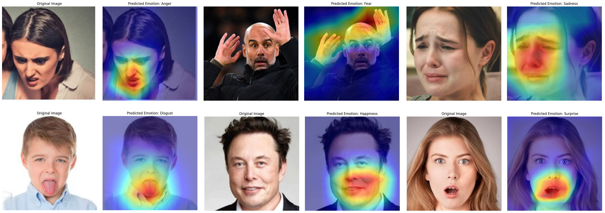  

The visualizations illustrate how each model effectively localized emotion-relevant facial regions during correct classifications. The **ConvNeXtbase** model accurately concentrated on the furrowed brows and clenched mouth for detecting *anger*, indicating sharp attention to facial tension. The **modified EfficientNetB2** model, predicting *fear*, highlighted widened eyes and raised hands, aligning well with *fear* expressions. For *sadness*, the **modified EfficientNetB3** variant captured downturned lips and furrowed brows, showing nuanced detection of emotional cues. The **EfficientNetB5** model targeting *disgust* focused on the nose and mouth area—consistent with the typical *disgust* expression. The **ResNet101V2** model's *happiness* prediction emphasized cheek areas and smile lines, while the **VGG19** model detecting *surprise* sharply concentrated on the open mouth and raised eyebrows. Collectively, these visualizations validate that despite architectural differences, each model learned to attend to biologically and psychologically relevant regions indicative of the corresponding emotions.  

Next 6 images illustrates examples of **attention mismatch** from the tested models.

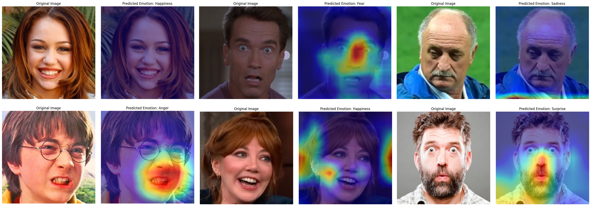  

The attention maps in these examples reveal noticeable mismatches between the salient facial regions and model focus, despite correct predictions. In the **ResNet101V2** example for *happiness*, attention is weak and scattered, missing key smile cues around the mouth and eyes. The **VGG19** model predicting *fear* largely emphasizes the nose and right eye but misses critical lower face tension, yielding a partial representation. **VGG16**’s *sadness* output focuses more on the subject's clothing and background rather than the eyes and mouth—core emotion indicators. The **ResNet50V2** model for *anger* does better, but still diffuses attention beyond essential facial regions like the clenched mouth or narrowed brows. The **EfficientNetB4** prediction for *happiness* oddly splits focus between the subject's mouth and background, reducing interpretability. Lastly, the **EfficientNetB5** prediction of *surprise* performs better but still fails to highlight key features like wide eyes and frowning eyebrows. Collectively, these mismatches suggest that although classification was successful, model interpretability suffers due to inconsistent or suboptimal attention localization.  

The last 6 images illustrate examples of **misclassification** from the tested models.  

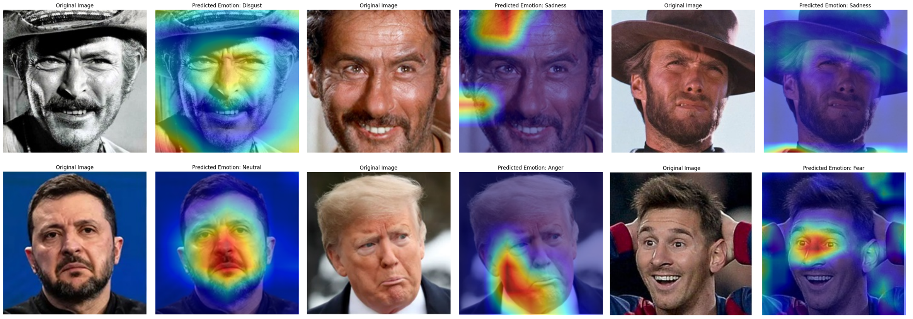  

These examples highlight key misclassifications despite attention heatmaps showing reasonable localization. In the first case, **ConvNeXtbase** mislabels a clear *happiness* expression as *disgust*, with attention spread across non-discriminative facial areas like the hat and lower face. The second example shows **EfficientNetB4** predicting *sadness* on a man clearly smiling—again a *happiness* cue misread, possibly due to shadows or wrinkles skewing perception. Similarly, **VGG16** mistakes a squinting but smiling face for *sadness*, likely misinterpreting the furrowed brows and harsh lighting. In the fourth case, **EfficientNetB5** classifies a serious or possibly concerned face as *neutral*, despite downturned lips and furrowed brow suggesting *sadness*. **ResNet101V2** incorrectly tags a pout—indicative of *sadness* or disapproval—as *anger*, perhaps overfitting on facial tension. Lastly, **VGG19** mislabels a *surprised/happy* reaction (wide eyes, open mouth, hands on head) as *fear*, showing how overlapping visual cues can confuse classifiers.  

Overall, while models like ConvNeXtbase and EfficientNetB3 achieved higher performance metrics overall, the VGG models (VGG16 and VGG19) consistently produced more focused and interpretable attention heatmaps. However, a common limitation across all models was their inability to accurately classify emotions in test images sourced from old movie screenshots—suggesting a domain gap due to differences in image quality, lighting, and expression style. This emphasizes the need for better domain adaptation and more diverse training data to improve generalization in real-world or vintage contexts. 

## 🚀 Deployment 

The Facial Emotion Recognition model has been successfully deployed as an interactive web application using Gradio on Hugging Face Spaces, allowing users to upload an image and instantly receive real-time emotion predictions through a simple and user-friendly interface. 

🔗 Live App 

👉 https://huggingface.co/spaces/ShaikhBorhanUddin/Facial_Emotion_Recognition 

<p align="center">
  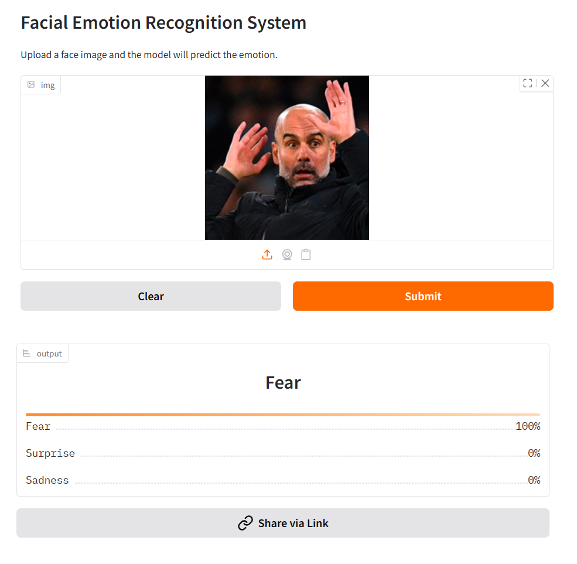
  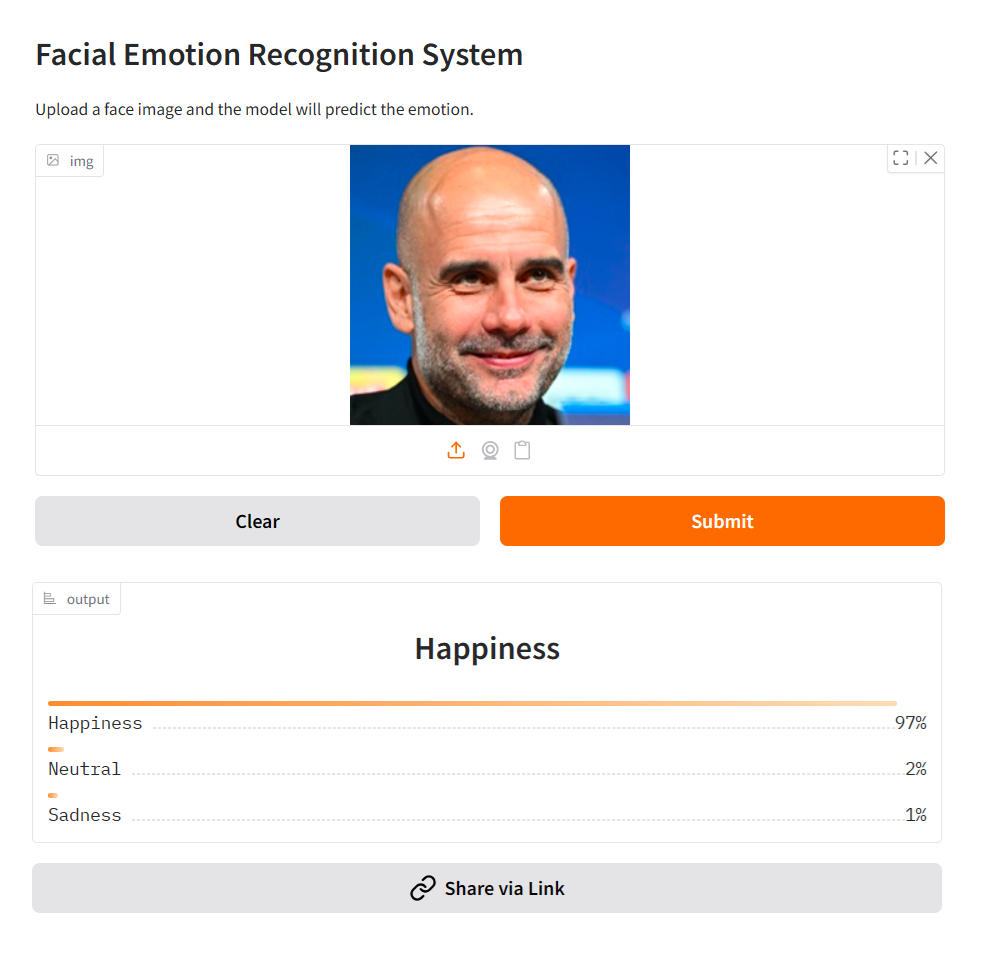
</p> 

To ensure a smooth and responsive user experience, computationally intensive Grad-CAM visualizations were intentionally excluded from the web application, as they significantly increase processing time and can lead to slower performance in a live environment. Additionally, although advanced architectures such as ConvNeXtBase and ResNet101V2 demonstrated excellent classification performance, their large model sizes (approximately 1GB and 500MB respectively) made them unsuitable for deployment within the constraints of the Hugging Face free tier. As a result, VGG19 was selected for deployment, offering a strong balance between performance and efficiency, while also outperforming lighter alternatives such as VGG16 and ResNet50. 

## 🌍 Practical Applications  

Facial Emotion Recognition (FER) technology is essential for advancing human-centered AI across various fields, including healthcare, education, retail, automotive, entertainment, and security. In **healthcare**, FER supports therapists by continuously monitoring a patient's emotional state during virtual sessions for timely interventions. In **education**, it enhances e-learning by identifying student confusion or disengagement in real time, allowing for adaptive content delivery. In **retail and customer service**, emotion recognition helps analyze customer sentiment during interactions, improving service and product recommendations. The **automotive** industry benefits from FER through driver monitoring systems that detect drowsiness, frustration, or distraction, enhancing road safety. Furthermore, in **entertainment**, FER creates responsive gaming and virtual reality environments based on player emotions. Lastly, it improves **security and surveillance** by detecting unusual or stress-induced facial expressions in public or high-risk areas, enabling proactive behavioral analysis.  

## 🔧 Tools & Technology  

`Python` `tensorFlow` `Keras` `EfficientNet` `VGG` `ResNet` `ConvNeXt` `A100` `Trillium`  
This Facial Emotion Recognition project was implemented primarily using Python, with TensorFlow and Keras serving as the core deep learning frameworks. These libraries provided the foundation for building, training, fine-tuning, and evaluating various state-of-the-art convolutional neural network architectures including EfficientNet, VGG, ResNet, and ConvNeXt. For training efficiency and scalability, most models were trained using Google Colab Pro with NVIDIA A100 GPUs, while the modified EfficientNetB2 and B3 models were trained on v5e Trillium TPUs, ensuring faster computations and reduced training time.

`Matplotlib` `seaborn` `GradCAM`  
In addition to model development, the project employed NumPy and pandas for data manipulation and preprocessing. Visualization and interpretability were emphasized through the use of Matplotlib, Seaborn, and Grad-CAM techniques (including Grad-CAM++) to highlight the key regions influencing model predictions. These techniques aided in gaining insights into model decision-making, particularly for misclassified emotion classes.

`Git` `GitHub`  
Version control was managed using Git, with all development hosted on GitHub, ensuring reproducibility and collaborative workflow. The Jupyter Notebook format was used throughout for experiment tracking, result logging, and visual analysis. Overall, the technology stack was designed to balance ease of development, training speed, and interpretability of results. 

`Gradio` `Hugging Face` 

Gradio was used to build a simple and interactive web interface for real-time emotion prediction from uploaded images, without requiring frontend development. The application is deployed on Hugging Face Spaces, providing an accessible and efficient platform to host and share the model online within resource constraints. 

## 🔄 How to Run Locally

To run the project locally, Python 3.8 or higher should be installed, along with essential libraries such as TensorFlow, NumPy, Pandas, Matplotlib, and scikit-learn. The repository should be cloned from GitHub, and all dependencies must be installed using the command pip install -r requirements.txt. The dataset is to be placed in the designated directory as specified in the code. Preprocessing and training scripts can then be executed in the recommended order. Models can be trained from scratch or loaded from available pretrained weights. Provided Jupyter notebooks or Python scripts should be used to evaluate performance, visualize outputs such as confusion matrices, and test the model on custom inputs using a local CPU or GPU setup.  

**Note** : For GPU acceleration, ensure your system supports CUDA and has necessary NVIDIA drivers installed. Alternatively, use Google Colab or Kaggle Notebooks for quick setup.

## ⚠️ Limitations  

Emotion is influenced by more than just facial expressions. Sound, movement, body language, the environment, objects, and psychological factors all significantly contribute to how we interpret emotions.   


**Figure**: Example of hand gesture, surrounding environment or body language not considered in the dataset  

For example, If we focus only on the facial expression in the image above (woman with salad bowl) ignoring the contextual cues like the salad bowl and fork, the emotion displayed can easily be misinterpreted as pain or frustration rather than disgust for salad. However, the deep learning models experimented in this study focuses solely on front-facing facial features within a controlled setting, which may limit the overall understanding of emotional expressions.


**Figure**: Images showing a complete side view were also not included in the model training  

The dataset does not fully align with [Plutchik's wheel of emotions](https://github.com/ShaikhBorhanUddin/Facial-Emotion-Recognition/blob/main/Image/wheel%20of%20emoion.png), which is a widely accepted model encompassing eight primary emotions—joy, trust, fear, surprise, sadness, disgust, anger, and anticipation—along with their intensities and complex combinations (e.g., love as a blend of joy and trust, or submission as a mix of trust and fear). While the FER_25 dataset covers basic, visually distinguishable categories like anger, sadness, happiness, and fear, it lacks representation for more nuanced or compound emotional states such as **sarcasm**, **enthusiasm**, **embarrassment**, or **contempt**.  


**Figure**: Example of blended or ambiguous emotions  

Due to hardware limitations in the Google Colab Pro environment (specifically, the 40 GB GPU RAM ceiling) experimentation with larger datasets or more complex but state-of-the-art deep learning models such as **EfficientNetB7**, **ViT-base**, or **DenseNet201** was not feasible. As shown in the resources usage images below, even models like **ConvNeXtbase**, **EfficientNetB4**, and **ResNet101V2** consumed nearly all available GPU memory (around 37–38.5 GB out of 40 GB), leaving no room for more parameter-heavy architectures or larger batch sizes. The high GPU memory consumption during training caused frequent crashes or throttling when trying to scale beyond this limit. This constraint restricted the exploration of potentially more accurate or generalizable models that require additional compute resources for training and fine-tuning.  

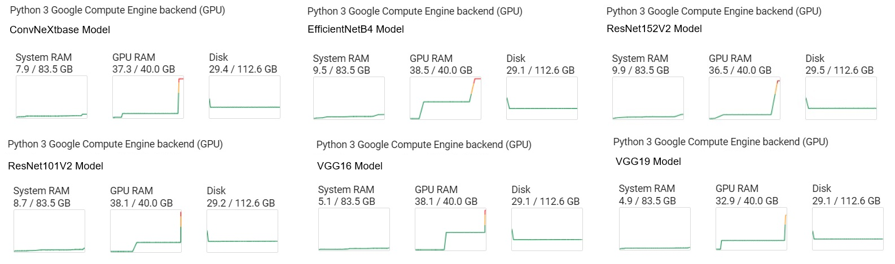  

Finally, while the model demonstrates strong performance on high-quality, well-lit images (particularly stock images from sources such as Getty Images or Shutterstock), it shows a noticeable decline in accuracy when applied to real-world inputs. This performance gap can be attributed to a distribution mismatch between the training data and real-world scenarios. 

<p align="center">
  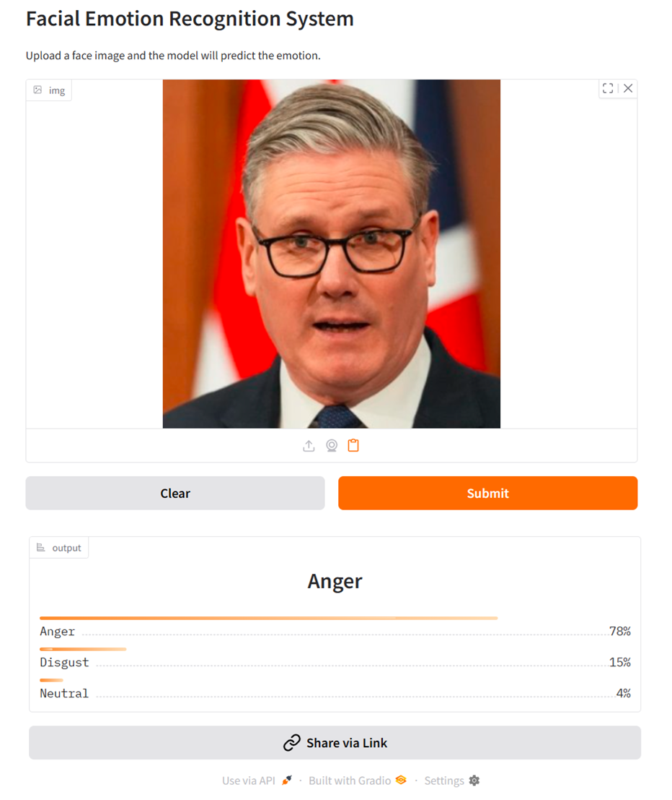
  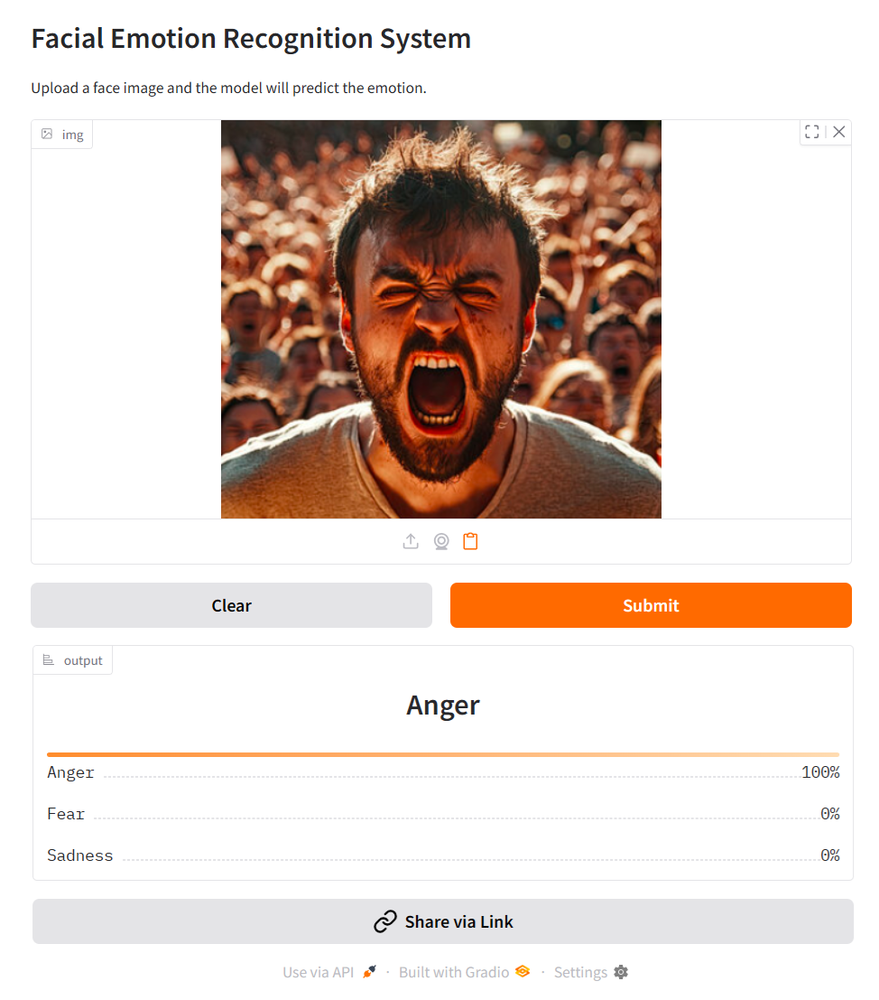
</p> 

Stock images typically present clear, exaggerated facial expressions under controlled lighting conditions, with minimal background noise and well-centered subjects. In contrast, real-world images often involve inconsistent lighting, multiple faces, and complex or cluttered backgrounds, all of which introduce variability that the model is not sufficiently robust to handle, leading to reduced reliability in emotion classification. 

## 🚧 Future Developments  
  
Looking ahead, the project aims to expand its scope by incorporating larger and more diverse datasets (like  [FERV39k](https://github.com/wangyanckxx/FERV39k) or [AffectNet](https://www.kaggle.com/datasets/mstjebashazida/affectnet)) that cover a broader range of emotion categories, aligning more closely with Plutchik’s Wheel of Emotions. This will enable finer-grained emotion recognition and improve generalization across demographics and contexts. In addition to dataset expansion, further architectural experimentation is planned—particularly exploring deeper and more varied dense layer configurations to better capture complex emotional cues.

The Swin Transformer (SWIN-base) model will also be tested as a promising alternative to convolutional architectures, potentially offering improved performance in visual understanding tasks due to its hierarchical attention mechanism. To support these enhancements and ensure faster, more scalable experimentation, the project will transition from Google Colab Pro to a dedicated virtual machine (VM) instance environment, providing greater computational flexibility and resource allocation for future training and evaluation. 

Furthermore, advanced model interpretability techniques such as Grad-CAM, Grad-CAM++, and Score-CAM will be incorporated in deployment to enhance visualization of model decision-making, providing deeper insights into feature importance and improving transparency in emotion classification. 

## 📄 License  

This project is licensed under the MIT License. You are free to use, modify, and distribute this project for personal or commercial purposes, provided that proper credit is given to the original author. See the Licence file for full details.
                     
## 📬 Contact

If you have any questions or would like to connect, feel free to reach out!

**Shaikh Borhan Uddin**  
📧 Email: [`shaikhborhanuddin@gmail.com`](mailto:shaikhborhanuddin@gmail.com)  
🔗 [`LinkedIn`](https://www.linkedin.com/in/shaikh-borhan-uddin-905566253/)  
🌐 [`Portfolio`](https://github.com/ShaikhBorhanUddin)

Feel free to fork the repository, improve the queries, or add visualizations!


